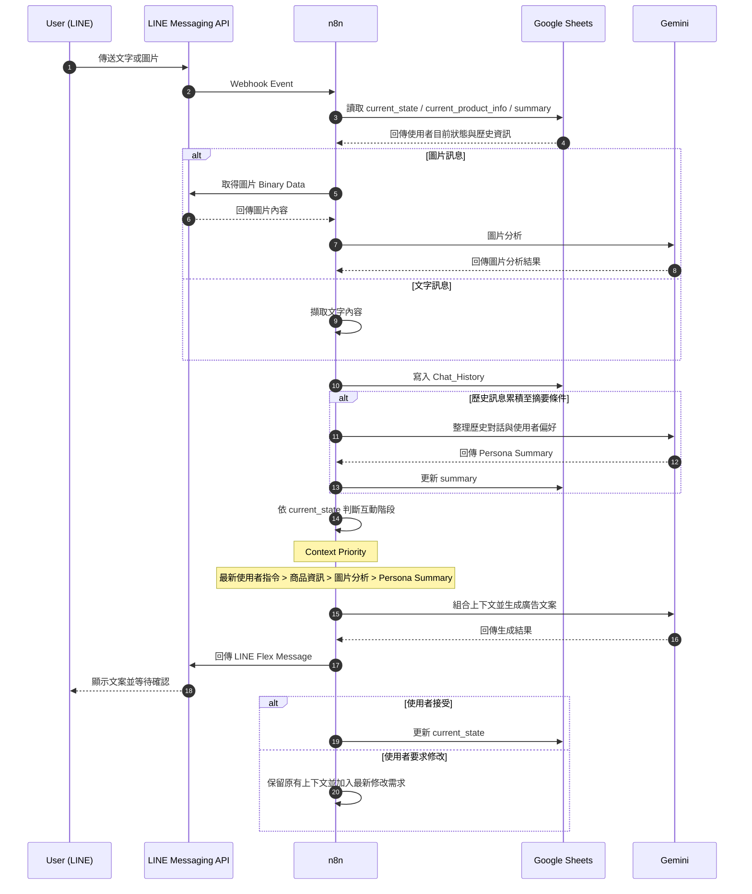
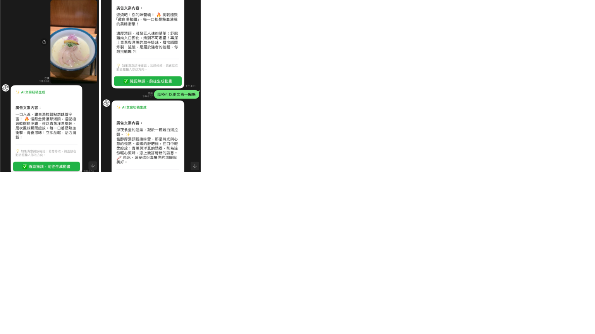
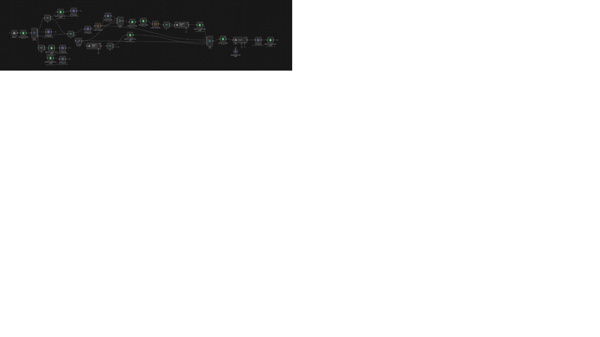
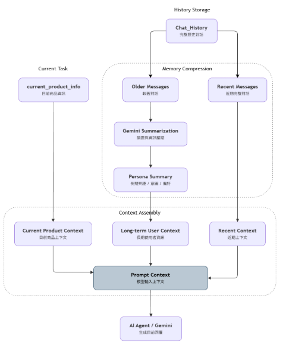

# 互動式個人化 AI 廣告生成系統

本專案以 LINE 作為使用者介面，透過 n8n 整合 Gemini、Google Sheets 與多階段互動流程，
讓使用者可輸入商品文字或圖片，並結合歷史對話與使用者偏好產生個人化廣告內容。

## 環境需求
- n8n
- LINE Developers 帳號
- Gemini API
- Google Sheets

## 快速開始
匯入工作流 JSON 後，請依個人環境重新設定 LINE、Gemini 與 Google Sheets 的 Credentials。

### 📁 最新版本
- [n8n-linebot-v3.json](./n8n-linebot-v3.json)

### ⚠️ 注意事項
- `n8n-linebot-v3.json` 為目前主要版本。
- `n8n-linebot-v2.json` 與 `n8n-linebot.json` 保留作為開發歷程紀錄。
- 匯入後需重新設定各項 API Credentials 與相關服務參數。

## 個人負責內容

本專題為團隊合作開發。除 ComfyUI 影像生成相關模組外，以下為我主要負責的部分：

- LINE Messaging API 與 Webhook 串接
- n8n 主要工作流程設計與整合
- 文字與圖片訊息分流及 Binary Data 處理
- Gemini 文字／圖片分析與內容生成串接
- FSM（Finite State Machine）多階段互動與狀態管理
- Chat History 與 Persona Summary 歷史資訊處理
- 模型上下文組合與資訊優先順序設計
- Human-in-the-Loop 文案確認與修改流程
- Google Sheets 資料儲存與讀取
- 整體工作流程測試、模組整合與除錯

> 此 Repository 主要保存本人負責之 n8n、LINE、Gemini 與資料流程相關內容，
> 不包含其他組員負責的 ComfyUI 影像生成模組。

## 系統互動流程

## 系統設計重點

### 1. 多來源資料流整合
系統需要同時處理文字、圖片、歷史對話與使用者狀態。不同來源的資料會先依性質分開處理，再於後續流程重新整合，以避免所有工作集中在單一路徑中造成流程過長或互相等待。

### 2. FSM 多階段互動
系統透過 `current_state` 保存使用者目前所在的互動階段，例如文案確認、動畫準備與影片確認。收到新訊息後，會先依目前狀態決定應進入的流程，使相同文字在不同階段可以被正確解讀。

### 3. 歷史資訊分層與 Persona Summary
近期對話保留較完整的內容，當歷史訊息累積到一定程度後，再利用 Gemini 整理成 Persona Summary，保存較長期的興趣、意圖與偏好。系統不使用向量資料庫，而是利用歷史資料與摘要動態組合模型上下文。

### 4. Hierarchical Prompt Funnel
為避免舊偏好干擾目前需求，系統設定上下文資訊的優先順序：

`最新使用者指令 > 目前商品資訊 > 圖片分析結果 > Persona Summary`

當不同來源出現衝突時，以使用者當下的最新要求為最高優先。

### 5. Human-in-the-Loop
模型產生文案後，不會直接進入下一階段，而是先透過 LINE Flex Message 讓使用者確認。使用者可接受內容或提出修改需求，系統再依目前狀態與既有上下文重新生成結果。

## 系統成果展示

### LINE 實際互動
以下為使用者透過 LINE 輸入商品資訊後，系統進行圖片分析、生成廣告文案，並透過確認與修改流程完成多階段互動。

### n8n 工作流程
系統主要透過 n8n 整合 LINE Messaging API、Gemini、Google Sheets、狀態管理與歷史資訊處理流程。

### 三軌資料流架構
為了避免文字、圖片與歷史資料全部集中在單一路徑中處理，系統將資料分為 History & Persona Stream、Image Parsing Stream 與 Instant Reply Stream，再於後續流程依需求重新整合。

### Persona Summary 與歷史資訊分層
系統將近期對話與較長期資訊分開處理，並利用 Persona Summary 保留較穩定的使用者興趣、意圖與偏好，再與目前商品資訊及近期對話共同組成模型上下文。

